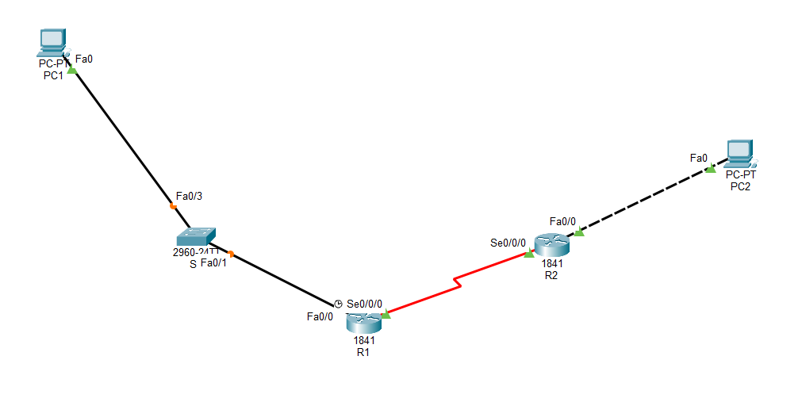
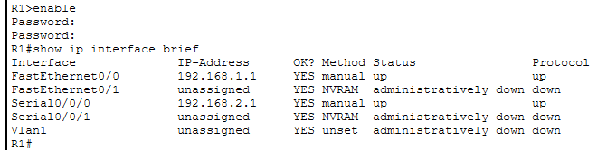
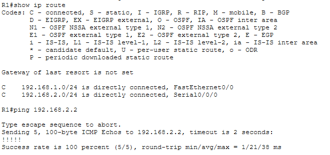

# Basic Router Configuration

Hands-on Cisco Packet Tracer lab based on **CCNA Exploration: Routing Protocols and Concepts — Lab 1.5.2: Basic Router Configuration**.

## Objectives

- Configure basic Cisco router settings
- Configure Ethernet and serial interfaces
- Assign IPv4 addresses
- Verify interface and routing configurations
- Test network connectivity

## Configuration

The lab consists of two routers and two PCs connected through Ethernet and a serial link.

Key configurations included:

- Hostname and basic router settings
- Console and VTY access
- IPv4 addressing
- FastEthernet interface configuration
- Serial interface configuration
- Serial clock rate
- Interface activation

Example interface configuration:

```
interface FastEthernet0/0
ip address 192.168.1.1 255.255.255.0
no shutdown
````

```
interface Serial0/0/0
ip address 192.168.2.1 255.255.255.0
clock rate 64000
no shutdown
```

## Verification

Interface status was verified using:

```
show ip interface brief
```

The routing table was inspected using:

```
show ip route
```

Connectivity was tested using:

```
ping 192.168.2.2
```

## Screenshots

### Network Topology



### Interface Verification



### Routing & Connectivity



## Files

* `Basic_Router_Config.pdf` — Lab instructions
* `Basic_Router_Config_Commands.txt` — Commands used during the lab
* `Basic_Router_Config_Packet_tracer.pka` — Packet Tracer activity

## Tools

• Cisco Packet Tracer • Cisco IOS CLI
