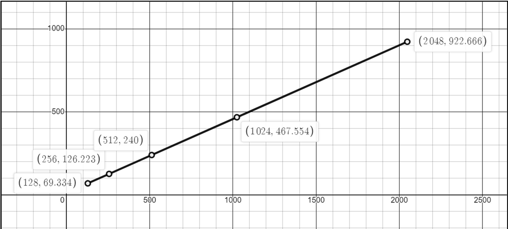
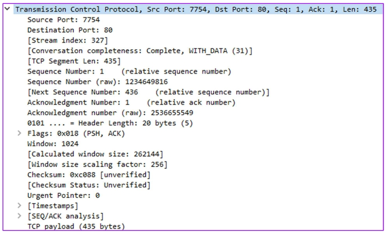

# Network Protocols & Analysis

A collection of networking analysis exercises using Cisco Packet Tracer, NS-3, and Wireshark. The labs focus on observing network communication across the application and transport layers, as well as packet-level analysis and network simulation.

## Exercises

### 1. DNS & ARP

Observed DNS and ARP communication in Cisco Packet Tracer by generating a web request and examining the resulting PDUs in Simulation Mode.

**Steps performed:**
1. Opened the network topology in Simulation Mode.
2. Generated a web request from the client to `www.test.com`.
3. Observed the DNS request used to resolve the web server address.
4. Observed ARP traffic used to determine the destination MAC address.
5. Examined the exchanged PDUs and protocol information.

**Topics:**
- DNS
- ARP
- Packet Tracer Simulation Mode
- PDU analysis

---

### 2. HTTP & SMTP

Examined application-layer protocol traffic in Cisco Packet Tracer, focusing on HTTP, SMTP, and POP communication.

**Steps performed:**
1. Generated application-layer traffic using the configured network services.
2. Captured the resulting packets in Simulation Mode.
3. Identified HTTP, SMTP, and POP traffic.
4. Examined the corresponding PDUs and protocol information.

**Topics:**
- HTTP
- SMTP
- POP
- Application-layer protocols
- PDU analysis

---

### 3. HTTP & TCP

Captured and examined TCP traffic generated during an HTTP request.

**Steps performed:**
1. Entered Simulation Mode and filtered the traffic to HTTP and TCP.
2. Generated an HTTP request from the client to the web server.
3. Captured the packets exchanged between the client and server.
4. Identified TCP segments associated with the HTTP request and response.
5. Examined the PDUs to observe TCP communication at different layers.

**Topics:**
- HTTP
- TCP
- Transport-layer protocols
- TCP PDU analysis
- Packet Tracer Simulation Mode

---

### 4. NS-3

Implemented a basic network simulation using NS-3 and Python to study network communication and performance.

**Steps performed:**
1. Created network nodes and a point-to-point connection.
2. Configured the network devices and communication parameters.
3. Configured UDP-based client/server communication.
4. Ran the simulation with different packet sizes.
5. Collected and analyzed the resulting network performance data.

**Topics:**
- NS-3
- Network simulation
- Point-to-point networking
- UDP
- Network performance analysis

#### NS-3 Result

---

### 5. Wireshark

Analyzed captured network traffic using Wireshark, focusing on TCP communication and packet-level information.

**Steps performed:**
1. Captured network traffic for an HTTP communication.
2. Opened the captured traffic in Wireshark.
3. Identified TCP packets associated with the communication.
4. Examined TCP header information and packet details.
5. Analyzed the observed TCP communication and related protocol fields.

**Topics:**
- Wireshark
- Packet capture and analysis
- TCP
- HTTP
- Network traffic inspection

#### Wireshark Analysis

---

## Tools

• Cisco Packet Tracer • NS-3 • Python • Wireshark
